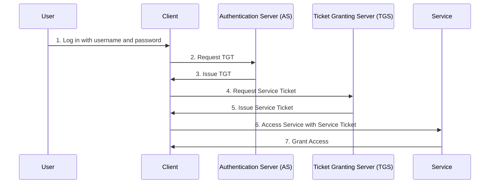

# 🌐 Introduction to Kerberos

Kerberos is a secure network authentication protocol designed to provide strong authentication for client-server applications. It uses secret-key cryptography to ensure that passwords are never sent over the network. The protocol was developed at MIT in the 1980s and is widely used in enterprise environments.

## 🔑 Key Concepts

### 🏢 **Key Distribution Center (KDC)**

The KDC is a trusted third party that issues tickets for authentication. It consists of two main components:

- **Authentication Server (AS):** Authenticates users when they initially attempt to access a service.
- **Ticket Granting Server (TGS):** Issues tickets that allow users to access services.

### 🔐 **Tickets**

Kerberos uses tickets to authenticate users and services. There are two main types of tickets:

- **Ticket Granting Ticket (TGT):** Issued by the AS and used to obtain service tickets from the TGS.
- **Service Ticket:** Issued by the TGS and used to access specific services on the network.

# 🔄 How Kerberos Works

This diagram represents the key steps in the Kerberos authentication process:

1. **User Authentication**: The user logs in with their username and password.
2. **Ticket Granting Ticket (TGT) Request**: The client application requests a TGT from the Authentication Server (AS).
3. **TGT Issuance**: The AS issues a TGT to the client application.
4. **Service Ticket Request**: The client application requests a service ticket from the Ticket Granting Server (TGS) using the TGT.
5. **Service Ticket Issuance**: The TGS issues a service ticket to the client application.
6. **Accessing the Service**: The client application presents the service ticket to the requested service.
7. **Service Access**: The service verifies the ticket and grants access to the user.

## 🔍 Benefits of Kerberos

- **Secure Authentication:** Uses secret-key cryptography to protect credentials and prevent eavesdropping and replay attacks.
- **Single Sign-On (SSO):** Users can authenticate once and access multiple services without re-entering credentials.
- **Scalability:** Suitable for large, distributed environments with many users and services.

## 📡 Ports Used by Kerberos

Kerberos typically uses port 88 for communication. This is different from web-based protocols like SAML and OAuth, which use HTTP/HTTPS on ports 80/443.

## 🌐 Comparison with SAML and OAuth

### SAML (Security Assertion Markup Language)

- **Protocol:** XML-based standard for exchanging authentication and authorization data.
- **Use Case:** Primarily used for web-based SSO in enterprise environments.
- **SSO:** Allows users to log in once and access multiple applications.
- **Message Format:** Uses XML for message exchange.
- **Ports:** Uses HTTP/HTTPS on ports 80/443.

### OAuth (Open Authorization)

- **Protocol:** Authorization framework that enables third-party applications to access user resources without exposing credentials.
- **Use Case:** Used for granting limited access to user information on other websites.
- **SSO:** Can be used with OpenID Connect (OIDC) for authentication.
- **Message Format:** Uses JSON for token exchange.
- **Ports:** Uses HTTP/HTTPS on ports 80/443.

### Kerberos vs. SAML vs. OAuth

| Feature      | Kerberos               | SAML                     | OAuth                    |
| ------------ | ---------------------- | ------------------------ | ------------------------ |
| **Protocol** | Network Authentication | XML-based Authentication | Authorization Framework  |
| **Use Case** | Enterprise Networks    | Web-based SSO            | Access to User Resources |
| **SSO**      | Yes                    | Yes                      | Yes (with OIDC)          |
| **Ports**    | Port 88                | HTTP/HTTPS (80/443)      | HTTP/HTTPS (80/443)      |

---

Kerberos is a robust and secure authentication protocol best suited for enterprise environments, providing secure Single Sign-On (SSO) and protecting credentials. SAML and OAuth serve different purposes but are commonly used for web-based applications, utilizing standard web ports.
