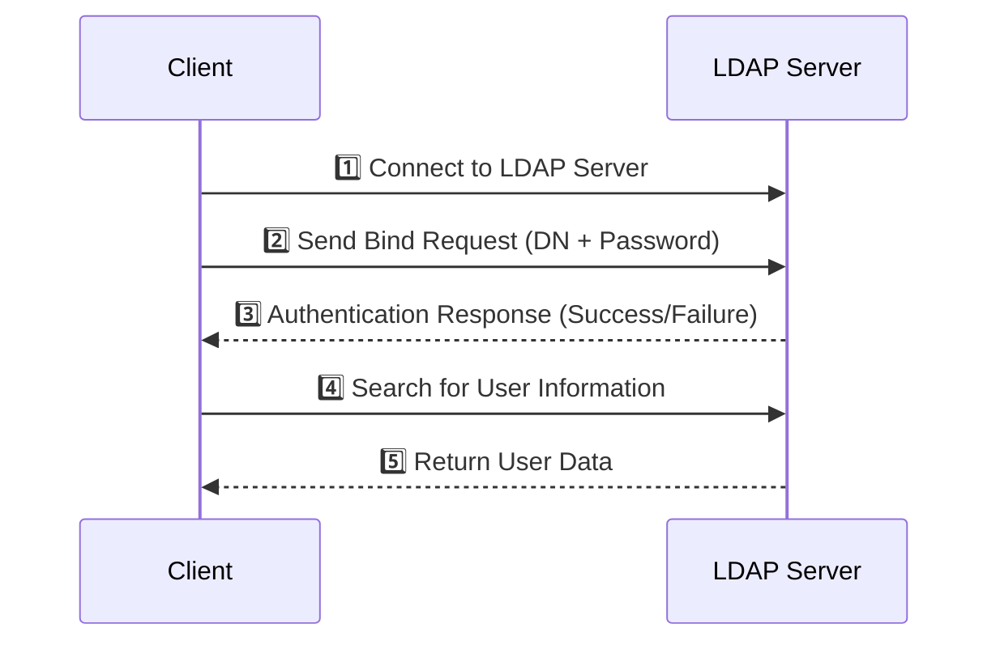

# 🔐 **LDAP (Lightweight Directory Access Protocol) – Full Guide**  

## 📌 **What is LDAP?**  
**LDAP (Lightweight Directory Access Protocol)** is an open protocol used to **manage and authenticate users within a directory service**. It provides a way for applications to communicate with directory servers to **query, authenticate, and manage users and groups**.  

🔹 **Common Use Cases:**  
✅ Centralized **user authentication** (e.g., corporate logins).  
✅ **User and group management** (e.g., Active Directory, OpenLDAP).  
✅ **Access control** for applications and network resources.  
✅ **Single Sign-On (SSO)** in combination with Kerberos or SAML.  

---

## 📁 **LDAP Directory Structure**  
LDAP stores data in a **hierarchical structure**, similar to a tree. Each entry is uniquely identified using a **Distinguished Name (DN)**.  

### 🏛 **LDAP Hierarchy Example:**  
```plaintext
dc=example,dc=com
│
├── ou=Users
│   ├── cn=John Doe (uid=johnd)
│   ├── cn=Jane Smith (uid=janes)
│
├── ou=Groups
│   ├── cn=Admins
│   ├── cn=Developers
```

🔹 **Key Terms:**  
- **DC (Domain Component)** → Represents the domain (e.g., `example.com`).  
- **OU (Organizational Unit)** → A group like "Users" or "Groups".  
- **CN (Common Name)** → A specific entry (e.g., a user or group).  
- **UID (User ID)** → A unique identifier for a user.  

---

## 🔑 **LDAP Authentication Flow**  
LDAP supports **binding**, which is the process of authenticating users. There are three types:  
1️⃣ **Anonymous Bind** – No credentials required (read-only access).  
2️⃣ **Simple Bind** – Uses a username (DN) and password (not secure unless encrypted).  
3️⃣ **SASL Bind** – Uses Kerberos, TLS, or other authentication mechanisms (more secure).  



🔹 **How it Works:**  
1️⃣ The client connects to the LDAP server.  
2️⃣ The client provides credentials (bind request).  
3️⃣ The LDAP server authenticates and responds.  
4️⃣ If authentication is successful, the client searches for user details.  
5️⃣ The LDAP server returns the user data.  

---

## ⚙️ **LDAP Authentication Example (via LDAP Bind)**  

### **1️⃣ Bind Request (Login)**
#### 🔹 **HTTP Example (LDAP over SSL – LDAPS)**
```http
POST /login HTTP/1.1
Host: ldap.example.com
Content-Type: application/json

{
    "username": "uid=johnd,ou=Users,dc=example,dc=com",
    "password": "SuperSecretPassword"
}
```

### **2️⃣ LDAP Query (Find User Info)**
#### 🔹 **LDAP Search Query**
```plaintext
ldapsearch -x -H ldaps://ldap.example.com -D "uid=johnd,ou=Users,dc=example,dc=com" -W -b "dc=example,dc=com"
```

### **3️⃣ Response (User Data)**
#### 🔹 **JSON Example**
```json
{
    "dn": "uid=johnd,ou=Users,dc=example,dc=com",
    "cn": "John Doe",
    "mail": "johnd@example.com",
    "uid": "johnd",
    "memberOf": ["cn=Admins,ou=Groups,dc=example,dc=com"]
}
```

---

## 🔄 **LDAP vs. Active Directory (AD) vs. OAuth 2.0**  

| Feature           | LDAP 🌳 | Active Directory (AD) 🏢 | OAuth 2.0 🔑 |
|------------------|--------|----------------------|------------|
| **Purpose**      | User authentication & directory lookup | Microsoft’s directory service with LDAP & Kerberos | API authorization & authentication |
| **Protocol**     | LDAP (TCP/389, LDAPS/636) | LDAP, Kerberos, NTLM | OAuth 2.0 (HTTPS) |
| **Best For**     | On-prem directory services | Windows-based enterprises | Cloud, mobile, and web apps |
| **Authentication** | Simple/SASL Bind | Integrated with Windows Login (Kerberos) | Access tokens & refresh tokens |
| **Single Sign-On (SSO)** | ❌ No (requires Kerberos or SAML) | ✅ Yes (Kerberos-based SSO) | ✅ Yes (OIDC, SAML) |
| **Modern APIs Support** | ❌ No | ❌ Limited | ✅ Yes |

---

## 🚀 **Advantages of LDAP**  
✅ **Fast, Lightweight** – Optimized for directory lookups.  
✅ **Widely Supported** – Used in OpenLDAP, Active Directory, AWS, etc.  
✅ **Centralized User Management** – Ideal for enterprise authentication.  
✅ **Integrates with SSO** – Can work with Kerberos & SAML for authentication.  

---

## ⚠️ **Limitations of LDAP**  
❌ **No Built-in SSO** – Requires Kerberos or SAML for SSO.  
❌ **Not Ideal for APIs** – Designed for authentication, not API authorization.  
❌ **Difficult to Scale** – Requires replication for high availability.  
❌ **Security Risks** – Simple Bind sends passwords in plaintext (unless using LDAPS).  

---

## 🏁 **Conclusion**  
- **LDAP is an older but powerful protocol for user authentication and directory lookups.**  
- **It's widely used in enterprises for centralized user management (Active Directory, OpenLDAP).**  
- **However, for modern cloud-based authentication and API security, OAuth 2.0 and OpenID Connect (OIDC) are better options.**  

Would you like a **guide on integrating LDAP with an application (e.g., Java, Python, or Node.js)?** 😊