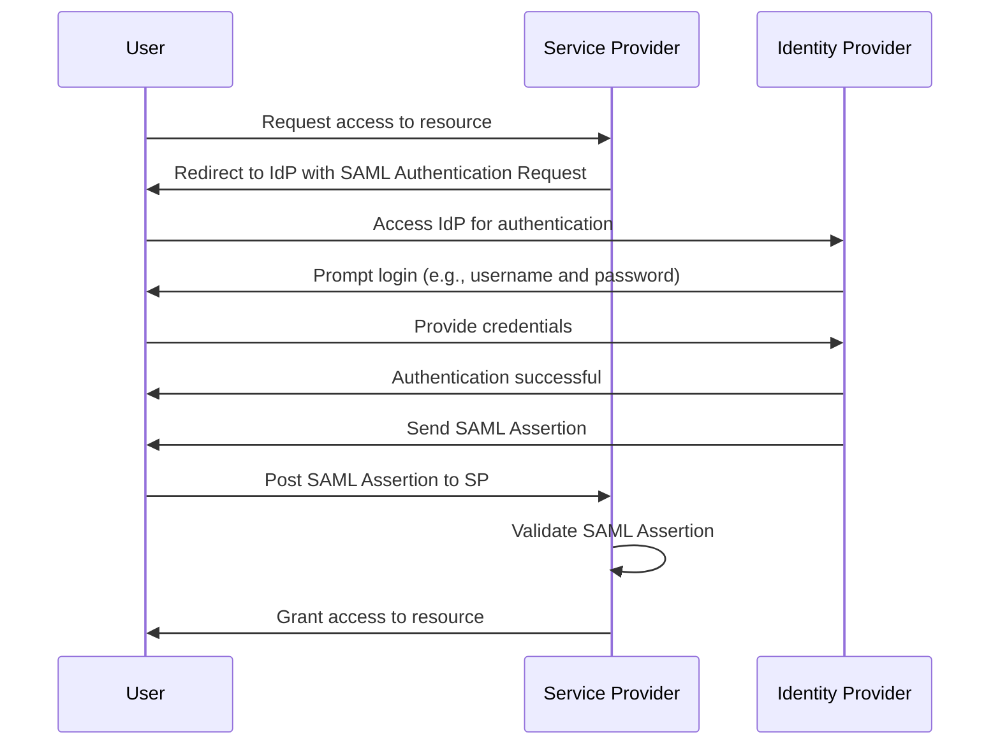

# **SAML 2.0**

**SAML** stands for **Security Assertion Markup Language**. It is an **XML-based open standard** used for exchanging authentication and authorization data between two parties:

- **Identity Provider (IdP)**: Authenticates the user.
- **Service Provider (SP)**: The application or service the user wants to access.

**🎯 Main Purpose**: SAML is primarily used for **Single Sign-On (SSO)**, allowing users to log in once and access multiple systems without re-entering credentials.

---

## **🔑 Key Components of SAML**

### **1. 🆔 Identity Provider (IdP)**

- The **IdP** is like a **gatekeeper** that verifies the user's identity.
- Examples: **Active Directory Federation Services (ADFS)**, **Okta**, **Azure AD**.

### **2. 🖥️ Service Provider (SP)**

- The **SP** is the application or service the user wants to use (e.g., a company's HR system or CRM tool).

### **3. 📜 SAML Assertion**

- A **SAML assertion** is an **XML document** that contains information about the user (e.g., username, roles, permissions).
- It is **signed** by the IdP to ensure it is authentic.

### **4. 🔄 SAML Protocol**

- Defines how SAML assertions are requested, exchanged, and validated.
- Common protocols:
  - **SAML Authentication Request Protocol**: Used by the SP to request authentication from the IdP.
  - **SAML Single Logout Protocol**: Used to log out a user from all sessions.

---

## **🔄 SAML Flow: Step-by-Step**

    

Here’s how SAML works in practice:

**Step 1: User Accesses the Service Provider (SP):**

- The user tries to access a protected resource on the SP (e.g., a company's HR system).

**Step 2: SP Redirects to the IdP:**

- The SP detects that the user is not authenticated and redirects the user to the IdP with a **SAML Authentication Request**.

**Step 3: User Authenticates with the IdP:**

- The IdP prompts the user to log in (e.g., username and password, multi-factor authentication).

**Step 4: IdP Generates a SAML Assertion:**

- After successful authentication, the IdP generates a **SAML assertion** containing user information.

**Step 5: IdP Sends the SAML Assertion to the SP:**

- The IdP sends the SAML assertion back to the SP via the user’s browser (using an HTTP POST request).

**Step 6: SP Validates the SAML Assertion:**

- The SP validates the SAML assertion (e.g., checks the signature, expiration time, and issuer).

**Step 7: SP Grants Access to the User:**

- If the SAML assertion is valid, the SP grants the user access to the requested resource.

---

---

## **👍 Advantages of SAML**

### **1. 🚀 Single Sign-On (SSO)**

- Users log in once and gain access to multiple systems without re-entering credentials.

### **2. 🌐 Federated Identity**

- Enables sharing of identity information across different domains and organizations.

### **3. 🔒 Security**

- SAML assertions are **signed** and optionally **encrypted**, ensuring data integrity and confidentiality.

### **4. 🏢 Widely Adopted**

- SAML is supported by many enterprise identity providers and service providers.

### **5. 🛡️ No Need for Password Sharing**

- Users do not need to share their passwords with third-party applications.

---

## **👎 Disadvantages of SAML**

### **1. 📄 XML-Based**

- SAML uses **XML** for encoding messages, which can be **verbose** and **complex** to parse.

### **2. ⏳ No Refresh Tokens**

- SAML does not support **refresh tokens**, making it unsuitable for **offline access** or long-lived sessions (e.g., mobile apps).

### **3. 📱 Limited Mobile Support**

- SAML is not well-suited for **mobile applications** due to its reliance on browser-based flows and lack of refresh tokens.

### **4. 🧩 Complexity**

- Implementing SAML can be **complex**, especially for developers unfamiliar with XML and cryptography.

### **5. 🐢 Performance**

- XML parsing and signing/verification can be **slower** compared to JSON-based protocols like OAuth 2.0.

---

## **🏢 Use Cases for SAML**

### **1. 🏛️ Enterprise SSO**

- SAML is widely used in enterprises to enable SSO across multiple applications (e.g., HR systems, CRM tools).

### **2. 🤝 Federated Identity**

- SAML enables organizations to share identity information with partners and customers.

### **3. 🖥️ Legacy Systems**

- SAML is often used to integrate with **legacy systems** that do not support modern protocols like OAuth 2.0.

---

## **🆚 SAML vs. OAuth 2.0/OpenID Connect (OIDC)**

| Feature             | SAML 2.0                           | OAuth 2.0/OIDC                                    |
| ------------------- | ---------------------------------- | ------------------------------------------------- |
| **Primary Purpose** | Authentication and SSO             | Authorization (OAuth 2.0) + Authentication (OIDC) |
| **Data Format**     | XML                                | JSON                                              |
| **Token Type**      | SAML Assertion                     | Access Token (JWT) + ID Token (JWT)               |
| **Refresh Tokens**  | Not supported                      | Supported                                         |
| **Mobile Support**  | Limited                            | Excellent                                         |
| **Use Cases**       | Enterprise SSO, federated identity | Modern apps, APIs, mobile apps                    |
| **Complexity**      | High                               | Lower                                             |

---

## **💡 Why SAML is Still Relevant**

Despite its limitations, SAML remains relevant in **enterprise environments** because:

- It is **widely supported** by legacy systems.
- It provides **strong security** for SSO and federated identity.
- Many organizations have already invested in SAML-based infrastructure.

---

## **🚀 Alternatives to SAML**

For modern applications, especially mobile apps and APIs, **OAuth 2.0** and **OpenID Connect (OIDC)** are preferred due to:

- **JSON-based tokens** (easier to parse and use).
- **Refresh tokens** for offline access.
- **Better mobile support**.
- **Simpler implementation**.

---

## **📝 Conclusion**

SAML 2.0 is a **robust protocol** for **enterprise SSO** and **federated identity**, but it has limitations (e.g., no refresh tokens, XML-based tokens) that make it less suitable for modern applications. For new projects, especially those involving mobile apps or APIs, **OAuth 2.0** and **OpenID Connect (OIDC)** are recommended. However, SAML remains a critical tool for integrating with legacy systems and enabling SSO in enterprise environments.
