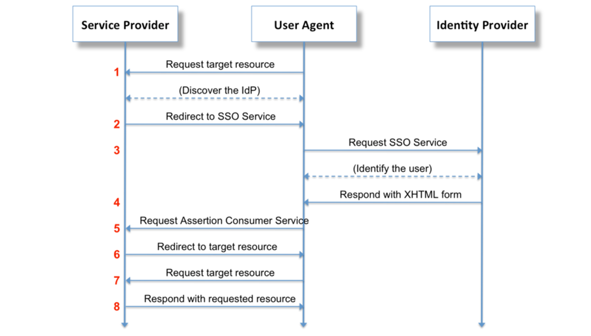
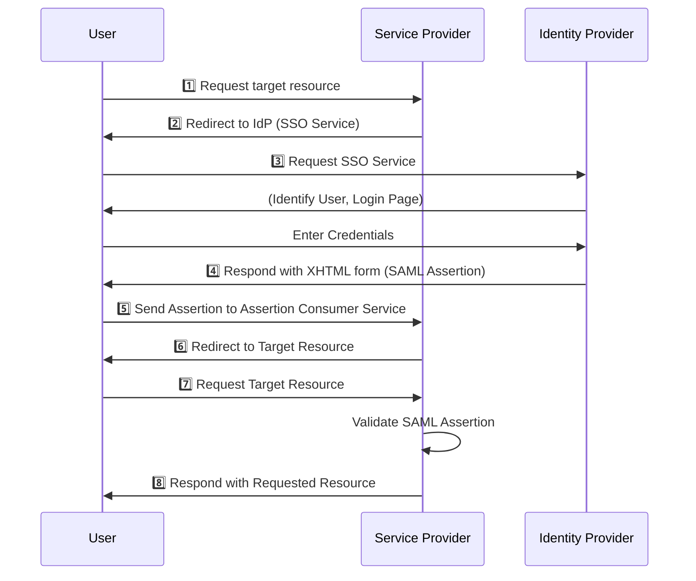
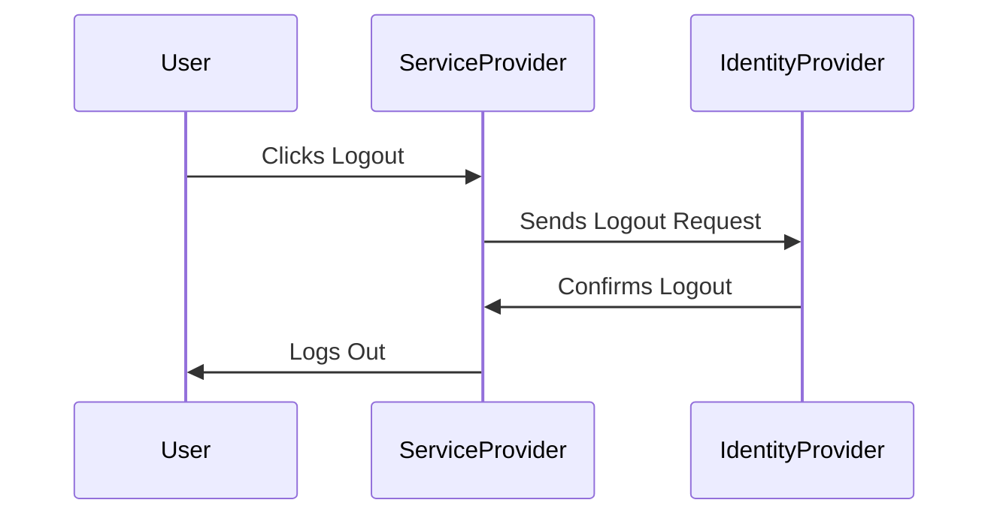

# 🔐 **SAML 2.0 – How It Works & Its Limitations**

**SAML (Security Assertion Markup Language)** is an XML-based protocol used for **Single Sign-On (SSO)** and identity federation.it is create in 2005 mainly for SSO for web apps, It enables users to log in once and access multiple applications without needing to re-enter credentials.

✅ **Common Use Cases:**

- Open standard used by many idP's (eg. MS Active Directory Federation services)
- Federated Identity (e.g., university systems, B2B integrations).
- Enterprise SSO (e.g., logging into multiple corporate apps).

🔴 **Limitations of SAML:**

- ❌ **No Offline Access** – SAML does not support refresh tokens like OAuth 2.0.
- ❌ **Heavy XML Format** – More complex than modern JSON-based protocols.
- ❌ **Not Ideal for Mobile Apps** – Works best in web-based environments.
- ❌ **Session-Based** – Unlike OAuth 2.0, SAML is not built for API authorization.

---

    

---

## 🏗️ **SAML Authentication Flow (SP-Initiated SSO)**

Here's how **SAML 2.0 authentication works**, following the **diagram you provided**:

### 📝 **Explanation of the Steps:**

1️⃣ The user requests access to a resource from the **Service Provider (SP)**.  
2️⃣ The **SP redirects** the user to the **Identity Provider (IdP)** for authentication.  
3️⃣ The **IdP verifies** the user’s identity (e.g., by showing a login page).  
4️⃣ After authentication, the **IdP generates a SAML Assertion** (an XML document proving the user is authenticated).  
5️⃣ The **User Agent (browser) sends the SAML Assertion to the SP** via an **XHTML form POST**.  
6️⃣ The SP verifies the assertion and **redirects the user to the target resource**.  
7️⃣ The user requests the resource again.  
8️⃣ The SP **grants access** and responds with the requested resource.

---

## 🔄 **SAML Logout Flow (Single Logout - SLO)**

SAML supports **Single Logout (SLO)** to ensure the user is logged out from all connected services.

---

## 🔑 **SAML vs. OAuth 2.0 vs. OpenID Connect (OIDC)**

| Feature               | SAML 🔐              | OAuth 2.0 🔑                | OpenID Connect 🆔           |
| --------------------- | -------------------- | --------------------------- | --------------------------- |
| **Primary Use**       | SSO (Single Sign-On) | API Authorization           | User Authentication & OAuth |
| **Format**            | XML                  | JSON                        | JSON (ID Token)             |
| **Token Type**        | SAML Assertion       | Access Token                | ID Token (JWT)              |
| **Best for**          | Enterprise SSO       | API Security                | Web & Mobile Authentication |
| **Offline Access**    | ❌ No                | ✅ Yes (via Refresh Tokens) | ✅ Yes (via Refresh Tokens) |
| **Mobile-Friendly**   | ❌ No                | ✅ Yes                      | ✅ Yes                      |
| **Standard for APIs** | ❌ No                | ✅ Yes                      | ✅ Yes                      |

🔴 **Why Modern Apps Prefer OAuth 2.0 / OIDC over SAML?**

- ✅ **Supports mobile & APIs** (SAML is designed for browsers).
- ✅ **JSON-based tokens (JWT)** (SAML uses heavy XML).
- ✅ **Supports offline access** with refresh tokens.

---

## **💡 Why SAML is Still Relevant**

Despite its limitations, SAML remains relevant in **enterprise environments** because:

- It is **widely supported** by legacy systems.
- It provides **strong security** for SSO and federated identity.
- Many organizations have already invested in SAML-based infrastructure.

## **🏢 Use Cases for SAML**

### **1. 🏛️ Enterprise SSO**

- SAML is widely used in enterprises to enable SSO across multiple applications (e.g., HR systems, CRM tools).

### **2. 🤝 Federated Identity**

- SAML enables organizations to share identity information with partners and customers.

### **3. 🖥️ Legacy Systems**

- SAML is often used to integrate with **legacy systems** that do not support modern protocols like OAuth 2.0.

## 🚀 **Conclusion**

- **SAML 2.0 is an older but still widely used protocol for Single Sign-On (SSO), especially in enterprise environments.**
- **It is being replaced by OAuth 2.0 and OpenID Connect (OIDC) for modern web and mobile applications.**
- **The biggest limitation of SAML is that it lacks offline access (no refresh tokens), making it less suitable for API-based authentication.**
