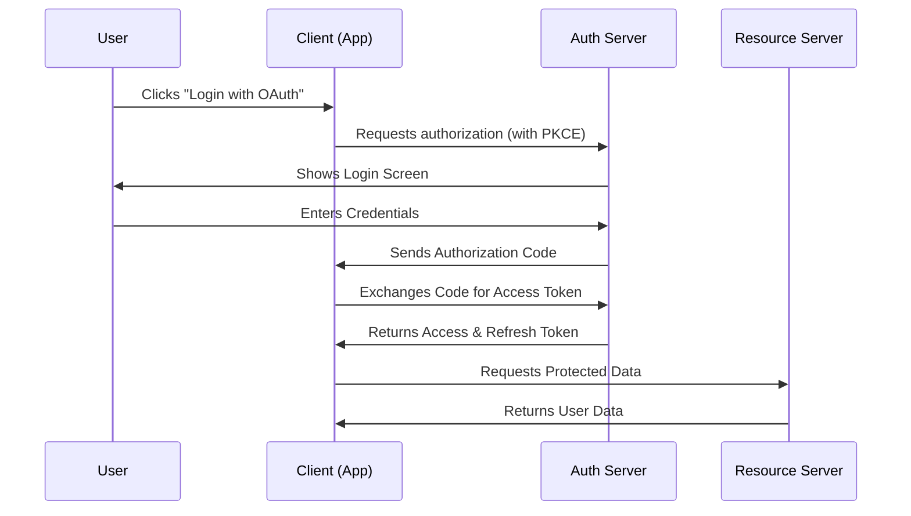
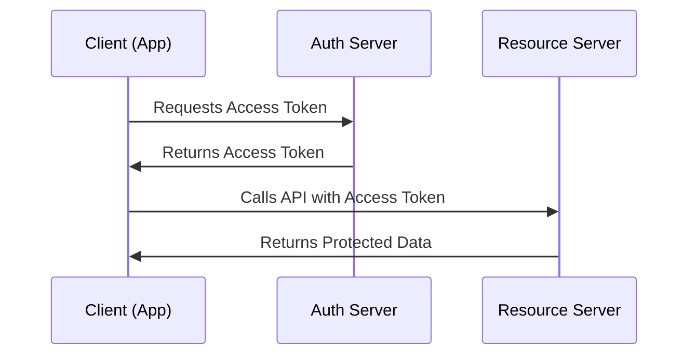
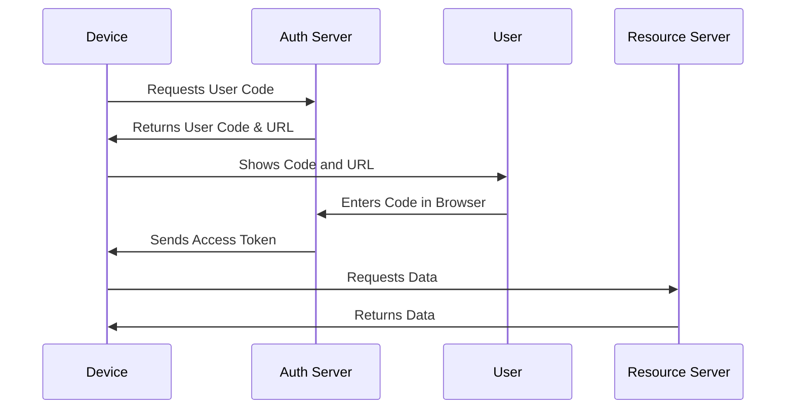
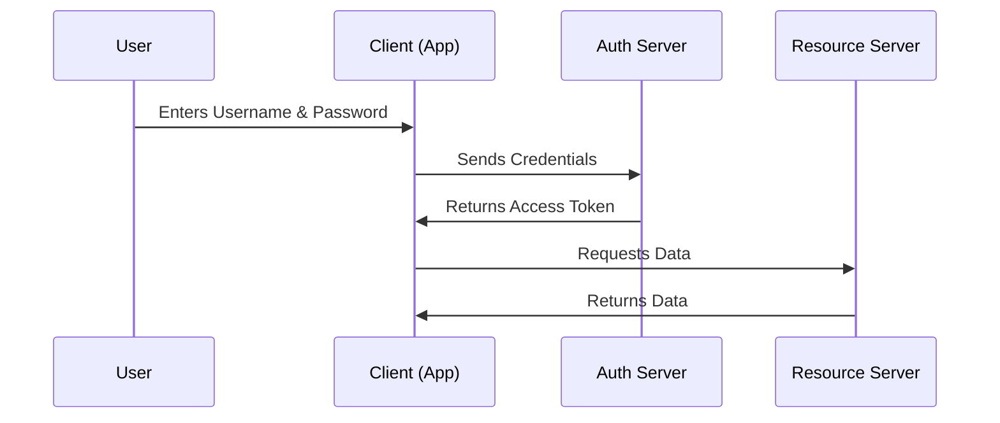
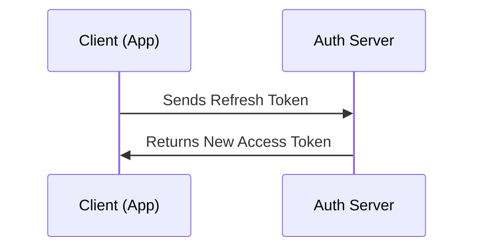

# 🔄 OAuth 2.0 Grant Types (Flows)

OAuth 2.0 provides different authorization flows (grant types) to support various application types and security requirements. Below, we explain each grant type with an easy-to-understand **Mermaid sequence diagram** and **implementation details (HTTP requests and responses).**

---

## 🔑 1. Authorization Code Flow (Best for Web & Mobile Apps)

### 📝 Overview

- The most secure flow, recommended for web and mobile applications.
- Uses **Authorization Code + Access Token** instead of exposing tokens in URLs.
- **PKCE (Proof Key for Code Exchange)** is required for public clients (mobile/SPAs).

### 📜 Sequence Diagram



### 🌍 Implementation

#### Step 1: Get Authorization Code

**Request:**

```http
GET /authorize
Host: auth.example.com
Content-Type: application/x-www-form-urlencoded

response_type=code&
client_id=CLIENT_ID&
redirect_uri=https://app.example.com/callback&
scope=openid profile email&
state=xyz&
code_challenge=CODE_CHALLENGE&
code_challenge_method=S256
```

**Response:**

```http
HTTP/1.1 302 Found
Location: https://app.example.com/callback?code=AUTHORIZATION_CODE&state=xyz
```

#### Step 2: Exchange Code for Tokens

**Request:**

```http
POST /token
Host: auth.example.com
Content-Type: application/x-www-form-urlencoded

grant_type=authorization_code&
code=AUTHORIZATION_CODE&
redirect_uri=https://app.example.com/callback&
client_id=CLIENT_ID&
client_secret=CLIENT_SECRET&
code_verifier=CODE_VERIFIER
```

**Response:**

```json
{
  "access_token": "ACCESS_TOKEN",
  "refresh_token": "REFRESH_TOKEN",
  "expires_in": 3600,
  "token_type": "Bearer",
  "id_token": "ID_TOKEN"
}
```

---

## 🔄 2. Client Credentials Flow (Best for Machine-to-Machine APIs)

### 📝 Overview

- Used when a **backend service (client) needs to access an API** without user interaction.
- No user login required, only **client authentication.**

### 📜 Sequence Diagram



### 🌍 Implementation

#### Step 1: Request Access Token

**Request:**

```http
POST /token
Host: auth.example.com
Content-Type: application/x-www-form-urlencoded

grant_type=client_credentials&
client_id=CLIENT_ID&
client_secret=CLIENT_SECRET&
scope=read
```

**Response:**

```json
{
  "access_token": "ACCESS_TOKEN",
  "token_type": "Bearer",
  "expires_in": 3600
}
```

#### Step 2: Access Protected Resource

**Request:**

```http
GET /resource
Host: api.example.com
Authorization: Bearer ACCESS_TOKEN
```

**Response:**

```json
{
  "data": "Protected resource data"
}
```

---

## 📱 3. Device Authorization Flow (Best for Smart TVs & IoT Devices)

### 📝 Overview

- Used for devices with **no keyboard or browser** (Smart TVs, Consoles, IoT).
- User enters a **code on a separate device** to authenticate.

### 📜 Sequence Diagram



### 🌍 Implementation

#### Step 1: Request Device Code

**Request:**

```http
POST /device/code
Host: auth.example.com
Content-Type: application/x-www-form-urlencoded

client_id=CLIENT_ID&
scope=openid profile
```

**Response:**

```json
{
  "device_code": "DEVICE_CODE",
  "user_code": "ABC123",
  "verification_uri": "https://auth.example.com/device",
  "expires_in": 300
}
```

#### Step 2: Poll for Access Token

**Request:**

```http
POST /token
Host: auth.example.com
Content-Type: application/x-www-form-urlencoded

grant_type=device_code&
device_code=DEVICE_CODE&
client_id=CLIENT_ID
```

**Response:**

```json
{
  "access_token": "ACCESS_TOKEN",
  "expires_in": 3600,
  "token_type": "Bearer"
}
```

---

## ❌ 4. Resource Owner Password Credentials (Deprecated)

### 📝 Overview

- Used for legacy apps where **users provide their username/password directly.**
- **Not recommended** due to security risks (exposes credentials to clients).

### 📜 Sequence Diagram



### 🌍 Implementation

#### Step 1: Request Access Token

**Request:**

```http
POST /token
Host: auth.example.com
Content-Type: application/x-www-form-urlencoded

grant_type=password&
username=USER_NAME&
password=USER_PASSWORD&
client_id=CLIENT_ID&
client_secret=CLIENT_SECRET
```

**Response:**

```json
{
  "access_token": "ACCESS_TOKEN",
  "expires_in": 3600,
  "token_type": "Bearer"
}
```

---

## 🔁 5. Refresh Token Flow

### 📝 Overview

- Used to get a **new access token** without asking the user to log in again.
- Improves user experience for **long-lived sessions.**

### 📜 Sequence Diagram



### 🌍 Implementation

#### Step 1: Refresh Access Token

**Request:**

```http
POST /token
Host: auth.example.com
Content-Type: application/x-www-form-urlencoded

grant_type=refresh_token&
refresh_token=REFRESH_TOKEN&
client_id=CLIENT_ID&
client_secret=CLIENT_SECRET
```

**Response:**

```json
{
  "access_token": "NEW_ACCESS_TOKEN",
  "expires_in": 3600,
  "token_type": "Bearer"
}
```

---

## 🚀 Conclusion

OAuth 2.0 offers multiple **grant types** tailored to different security and usability needs. **Authorization Code Flow with PKCE** is the most secure option for web and mobile apps, while **Client Credentials Flow** is best for machine-to-machine interactions. **Device Flow** supports authentication on limited-input devices, and **Refresh Tokens** help maintain long-lived sessions.
