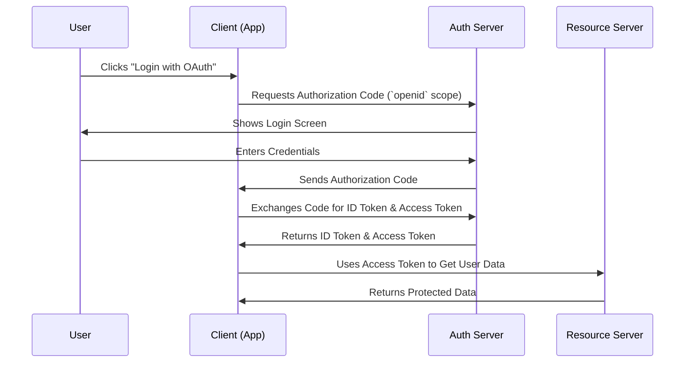

# 🆔 ID Token in OAuth 2.0 & OpenID Connect

## 🔍 What is an ID Token?

An **ID Token** is a JSON Web Token (**JWT**) issued by an **OpenID Connect (OIDC) provider** as part of the authentication process. Unlike an **Access Token**, which is used to access APIs, an **ID Token** is used to verify a user's identity.

It is typically returned **alongside the Access Token** in OAuth 2.0 **Authorization Code Flow** when the `openid` scope is requested.

---

## 🏗️ ID Token vs Access Token

| Feature             | ID Token 🆔                        | Access Token 🔑                                |
| ------------------- | ---------------------------------- | ---------------------------------------------- |
| Purpose             | Identifies the authenticated user  | Grants access to APIs                          |
| Format              | JWT (JSON Web Token)               | Can be JWT or opaque                           |
| Scope               | Requires `openid` scope            | Defined by API (`read`, `write`, etc.)         |
| Contains User Info? | Yes (`sub`, `name`, `email`, etc.) | No                                             |
| Expiration          | Short-lived                        | Short or long-lived (depends on refresh token) |

---

## 📜 How is the ID Token Issued?

An **ID Token** is issued during the **Authorization Code Flow** when the `openid` scope is included in the authorization request.

### 📜 Sequence Diagram



---

## 🛠️ ID Token Implementation

### **Step 1: Get Authorization Code with `openid` Scope**

**Request:**

```http
GET /authorize
Host: auth.example.com
Content-Type: application/x-www-form-urlencoded

response_type=code&
client_id=CLIENT_ID&
redirect_uri=https://app.example.com/callback&
scope=openid profile email&
state=xyz&
code_challenge=CODE_CHALLENGE&
code_challenge_method=S256
```

**Response:**

```http
HTTP/1.1 302 Found
Location: https://app.example.com/callback?code=AUTHORIZATION_CODE&state=xyz
```

---

### **Step 2: Exchange Authorization Code for Tokens**

**Request:**

```http
POST /token
Host: auth.example.com
Content-Type: application/x-www-form-urlencoded

grant_type=authorization_code&
code=AUTHORIZATION_CODE&
redirect_uri=https://app.example.com/callback&
client_id=CLIENT_ID&
client_secret=CLIENT_SECRET&
code_verifier=CODE_VERIFIER
```

**Response:**

```json
{
  "access_token": "ACCESS_TOKEN",
  "id_token": "ID_TOKEN",
  "refresh_token": "REFRESH_TOKEN",
  "expires_in": 3600,
  "token_type": "Bearer"
}
```

---

## 📜 Decoding an ID Token

The **ID Token** is a JWT (**JSON Web Token**) with three parts:

1. **Header** – Metadata about the token (e.g., signing algorithm).
2. **Payload (Claims)** – Contains user information.
3. **Signature** – Ensures the token has not been tampered with.

### **Example ID Token (Decoded JWT)**

```json
{
  "alg": "RS256",
  "typ": "JWT"
}
```

```json
{
  "iss": "https://auth.example.com",
  "sub": "1234567890",
  "aud": "CLIENT_ID",
  "exp": 1712345678,
  "iat": 1712341678,
  "nonce": "random-nonce-value",
  "email": "user@example.com",
  "name": "John Doe",
  "picture": "https://example.com/avatar.jpg"
}
```

---

## 🔐 Validating an ID Token

1. **Check Signature** – Verify the token was signed by the **OIDC provider’s public key.**
2. **Verify `iss` (Issuer)** – Ensure it matches the expected OpenID provider URL.
3. **Verify `aud` (Audience)** – Ensure the token is meant for your client.
4. **Check Expiration (`exp`)** – Ensure the token is still valid.
5. **Validate Nonce (if used)** – Helps prevent replay attacks.

---

## 🌍 Fetching Additional User Info

If the **ID Token** does not contain all user details, you can fetch more information using the **UserInfo Endpoint**.

**Request:**

```http
GET /userinfo
Host: auth.example.com
Authorization: Bearer ACCESS_TOKEN
```

**Response:**

```json
{
  "sub": "1234567890",
  "email": "user@example.com",
  "name": "John Doe",
  "picture": "https://example.com/avatar.jpg"
}
```

---

## 🚀 Conclusion

- **ID Tokens** are used for **authentication** (who the user is).
- **Access Tokens** are used for **authorization** (what the user can do).
- ID Tokens follow **JWT format** and include user details.
- Always **validate ID Tokens** before trusting them.
- Use the **UserInfo endpoint** for additional user details if needed.
