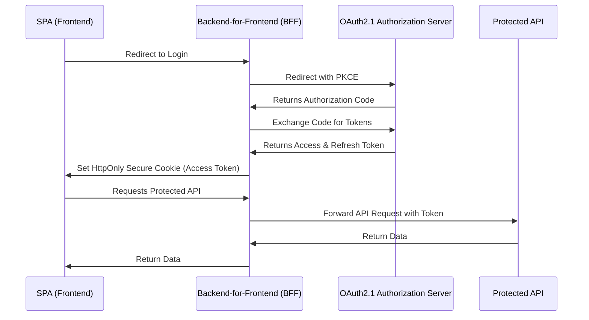
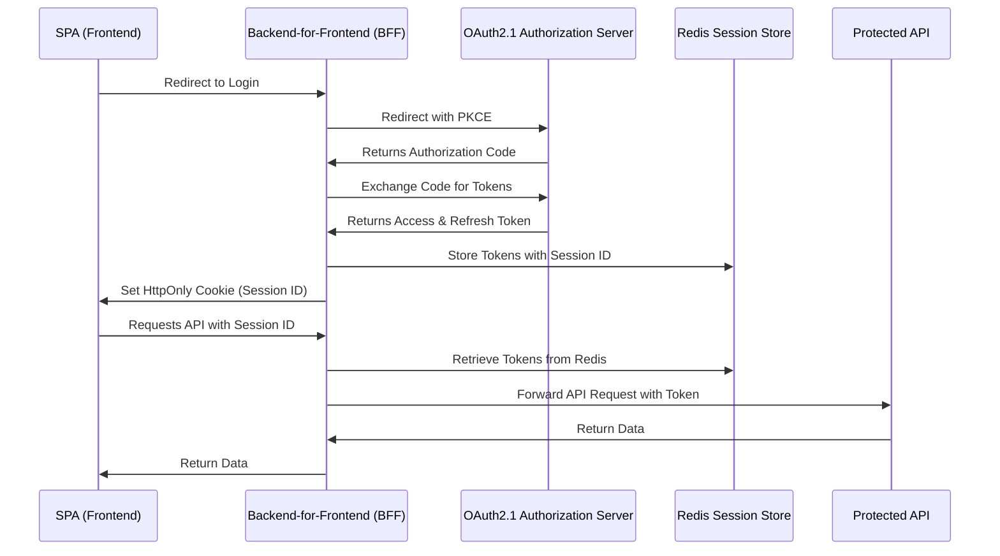

# 🛡️ **Securing OAuth 2.1 Tokens in SPA Using BFF**

OAuth 2.1 improves security for **Single Page Applications (SPA)** by removing implicit flow and requiring **Authorization Code Flow with PKCE**. However, a major challenge remains:

🚨 **Where should we store access and refresh tokens securely?**

The best solution is to use a **Backend-for-Frontend (BFF)**, which acts as an intermediary between the SPA and the OAuth provider. But within the BFF, we have two primary approaches for handling tokens:

1. **Storing tokens in HTTP-only cookies** (safe from XSS but needs CSRF protection).
2. **Using Redis for session storage** (fast, scalable, and secure).

Let’s explore both approaches! 🚀

---

## 🔐 **Approach 1: Storing Tokens in HTTP-only Cookies**

### **Flow Diagram**



### **How It Works**

1. The **SPA redirects** to the **BFF login endpoint**.
2. The **BFF handles OAuth2.1 Authorization Code Flow with PKCE**.
3. The BFF **stores tokens in HTTP-only cookies** (not accessible by JavaScript).
4. The SPA **sends requests to the BFF without needing a token**.
5. The **BFF retrieves the token from cookies** and forwards requests to the API.

### **.NET Implementation (BFF)**

#### **Step 1: Setting the HTTP-only Cookie**

```csharp
HttpContext.Response.Cookies.Append("AccessToken", accessToken, new CookieOptions
{
    HttpOnly = true,   // Prevents JavaScript access
    Secure = true,     // Requires HTTPS
    SameSite = SameSiteMode.Strict, // Prevents CSRF attacks
    Expires = DateTime.UtcNow.AddMinutes(15)
});
```

#### **Step 2: Retrieving Token in API Requests**

```csharp
var accessToken = HttpContext.Request.Cookies["AccessToken"];
if (string.IsNullOrEmpty(accessToken))
{
    return Unauthorized();
}
```

#### **Step 3: Example API Response**

```json
{
  "message": "Data retrieved successfully",
  "data": { "id": 1, "name": "Secure Data" }
}
```

#### **Advantages**

✅ Secure against **XSS** (tokens are never exposed).  
✅ SPA does not need to **store or manage tokens**.

#### **Disadvantages**

❌ Needs **CSRF protection** (e.g., CSRF tokens).  
❌ Cookies **may not work well with third-party APIs**.

---

## 🏎️ **Approach 2: Using Redis Session Storage**

### **Flow Diagram**



### **How It Works**

1. The SPA **redirects to the BFF login endpoint**.
2. The BFF **retrieves the OAuth2.1 tokens and stores them in Redis**.
3. The BFF **sends only a session ID (in an HTTP-only cookie)** to the frontend.
4. The SPA **sends requests with the session ID**.
5. The **BFF fetches tokens from Redis and calls the API**.

### **.NET Implementation (BFF)**

#### **Step 1: Storing Tokens in Redis**

```csharp
var sessionId = Guid.NewGuid().ToString();
var tokenData = new { AccessToken = accessToken, RefreshToken = refreshToken };
await _redis.SetStringAsync(sessionId, JsonSerializer.Serialize(tokenData),
    new DistributedCacheEntryOptions
    {
        AbsoluteExpirationRelativeToNow = TimeSpan.FromMinutes(30)
    });

HttpContext.Response.Cookies.Append("SessionId", sessionId, new CookieOptions
{
    HttpOnly = true,
    Secure = true,
    SameSite = SameSiteMode.Strict
});
```

#### **Step 2: Retrieving Tokens from Redis**

```csharp
var sessionId = HttpContext.Request.Cookies["SessionId"];
if (string.IsNullOrEmpty(sessionId)) return Unauthorized();

var tokenDataJson = await _redis.GetStringAsync(sessionId);
if (string.IsNullOrEmpty(tokenDataJson)) return Unauthorized();

var tokenData = JsonSerializer.Deserialize<TokenData>(tokenDataJson);
```

#### **Step 3: Example API Response**

```json
{
  "message": "Secure data retrieved",
  "user": { "id": 1, "email": "user@example.com" }
}
```

#### **Advantages**

✅ Secure against **XSS & CSRF**.  
✅ **Scalable** (supports multiple sessions).  
✅ **No direct token exposure to the frontend**.

#### **Disadvantages**

❌ Requires **Redis setup and management**.  
❌ Needs **session expiration handling**.

---

## 🔥 **Which Approach Should You Choose?**

| Approach                  | Security                                   | Performance                        | Scalability                          |
| ------------------------- | ------------------------------------------ | ---------------------------------- | ------------------------------------ |
| **HTTP-only Cookies**     | ✅ High (XSS protection)                   | ⚡ Fast (built-in)                 | ❌ Not ideal for multi-instance apps |
| **Redis Session Storage** | ✅✅ Very High (Tokens stored server-side) | ⚡⚡ Slight overhead (Redis calls) | ✅✅ Best for multi-instance apps    |

👉 If your app is **simple and monolithic**, use **HTTP-only cookies**.  
👉 If your app **scales across multiple servers**, **use Redis** for better session management.

---

## 🎯 **Final Thoughts**

Using **OAuth2.1 with BFF** provides a **secure way** to handle tokens in SPA applications. The best practice is to **never store access tokens in the frontend**.

🔹 **HTTP-only cookies** provide a simple and effective solution for small apps.  
🔹 **Redis session storage** is ideal for **scalable, high-security applications**.

By implementing either approach, your SPA will be **secure against XSS, CSRF, and token theft** while maintaining **a seamless user experience**. 🚀
