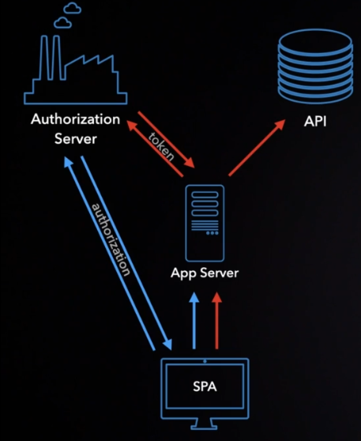

# OAUTH2.0 & OpenID Connect

## 1. Where to store tokens (access_tokens & refresh_tokens)

simple answer is don't store them

- use service worker or web-crypto (not Recommend)
- use web-crypto
- use dynamic backend server for SPA (more recommended)
  - it sometimes called BFF, which mean there a server that have the static angular app and that server is deals with ids and also it get the tokens and then he has two options:-
    - make server set https only cookie for the SPA (Recommended)
    - make redis caching that cache users tokens and set session id for it and set that session as cookie for SPA
      

## 2. How to Revoke Refresh Token

by logout from ids which will clear the session on ids

## 3. How to Revoke Access Token

> NOTE: ⚠️  
> it is very hard to implement it and OAUTH ORG works on it right now by adding a revoke endpoint in ids that open web socket channel with all its apis so when you call that endpoint it will push notification to its apis to let them now that access token is should have no access to its resources, and the api should handle it ( i don't know how it will handle it).

for now you can use only make the sensitive endpoint in the api to validate the role and the status for the user from db by decode the access token before the accessing the endpoint resource

it will be headache because you will check that logic and send request what ever in another api or in db foreach access to that endpoint.

## 4. Is it ok to hold User Id in id_token in order to identify it later ?

yes it is ok.
